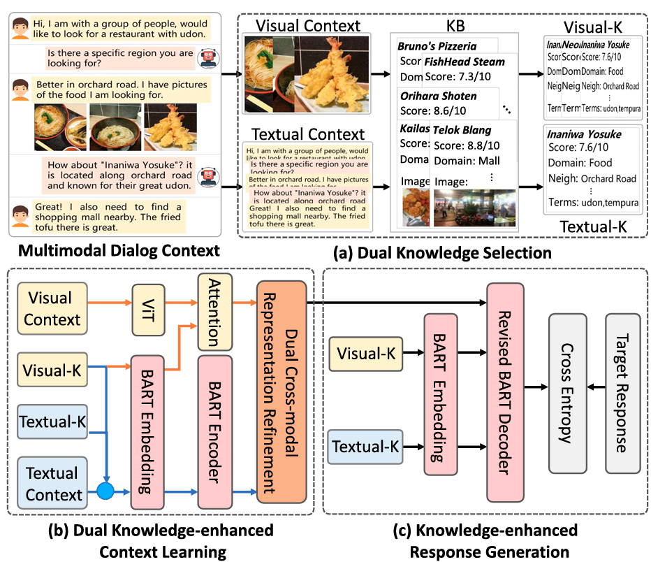

# Multimodal Dialog Systems with Dual Knowledge-enhanced Generative Pretrained Language Model

> [TOIS 2024] Official implementation of DKMD, a dual knowledge-enhanced generative pretrained language model for multimodal task-oriented dialog systems.


## Authors

**Xiaolin Chen**<sup>1</sup>, **Xuemeng Song**<sup>1</sup>\*, **Liqiang Jing**<sup>1</sup>, **Shuo Li**<sup>1</sup>, **Linmei Hu**<sup>2</sup>, **Liqiang Nie**<sup>1</sup>\*

<sup>1</sup> Shandong University, Shandong, China  
<sup>2</sup> Beijing Institute of Technology, Beijing, China  
\* Corresponding authors

## Links

- **Paper**: [ACM Digital Library](https://doi.org/10.1145/3606368)
---

## Table of Contents

- [Updates](#updates)
- [Introduction](#introduction)
- [Highlights](#highlights)
- [Method / Framework](#method--framework)
- [Project Structure](#project-structure)
- [Installation](#installation)
- [Usage](#usage)
- [Evaluation](#evaluation)
- [Citation](#citation)
- [Acknowledgement](#acknowledgement)
- [License](#license)

---

## Updates

- [10/2023] Paper accepted at ACM Transactions on Information Systems (TOIS)
- [10/2023] Release code and parameters

---

## Introduction

This repository is the official implementation of the paper **"Multimodal Dialog Systems with Dual Knowledge-enhanced Generative Pretrained Language Model"**, published in ACM Transactions on Information Systems (TOIS), 2024.

Text response generation for multimodal task-oriented dialog systems is an essential yet challenging task. Existing efforts still suffer from two pivotal limitations: (1) overlooking the benefit of generative pre-training, and (2) ignoring the textual context-related knowledge. To address these limitations, we propose **DKMD** (Dual Knowledge-enhanced generative pretrained language Model for multimodal task-oriented Dialog systems), where BART is adopted as the backbone. DKMD consists of three key components:

- **Dual Knowledge Selection**: Selects context-related knowledge from the knowledge base according to both textual and visual modalities of the given context.
- **Dual Knowledge-enhanced Context Learning**: Seamlessly integrates the selected knowledge into the multimodal context learning from both global and local perspectives, while exploring the cross-modal semantic relation via dual cross-modal representation refinement.
- **Knowledge-enhanced Response Generation**: Comprises a revised BART decoder with an additional dot-product knowledge-decoder attention (DKDA) sub-layer to explicitly use knowledge for precise text response generation.

---

## Highlights

- Among the first to integrate generative pretrained language models (GPLMs) into multimodal task-oriented dialog systems
- Proposes dual knowledge selection to acquire context-related knowledge from both textual and visual modalities
- Designs dual cross-modal representation refinement (vision-oriented and text-oriented) to capture cross-modal semantic relations
- Devises a knowledge-enhanced BART decoder with dot-product knowledge-decoder attention for precise response generation
- Achieves state-of-the-art performance on public multimodal task-oriented dialog benchmark

---

## Method / Framework



**Figure 1.** Overall framework of DKMD, which consists of three vital components: (a) Dual Knowledge Selection, (b) Dual Knowledge-enhanced Context Learning, and (c) Knowledge-enhanced Response Generation.

---

## Project Structure

```text
.
├── asserts/               # Figures and framework diagrams
├── config/                # Configuration files
├── dataset/               # Dataset and data processing scripts
├── lib/                   # Library dependencies
├── model/                 # Model architecture definitions
├── target_file/           # Target files for evaluation
├── tools/                 # Utility tools
├── util/                  # Utility functions
├── constant.py            # Constants and hyperparameters
├── train.py               # Training script
├── train.sh               # Shell script for training
├── eval_2.sh              # Shell script for evaluation
├── README.md
└── ...
```

---

## Installation

### 1. Clone the repository

```bash
git clone https://github.com/iLearn-Lab/DKMD.git
cd DKMD
```

### 2. Prerequisite

- Python 3.8
- PyTorch 1.0
- NLTK 3.7
- transformers 4.3.2

---

## Usage

### Training

```bash
sh train.sh <gpu_id> text <model_file> <output_file>
```

---

## Evaluation

Perl script [mteval-v14.pl](https://github.com/moses-smt/mosesdecoder/blob/master/scripts/generic/mteval-v14.pl) is used to evaluate the text result. You should first extract the result from the log files and convert them into XML file. For convenience, the `convert.py` is provided.

---

## Citation

If you find this work useful for your research, please cite our paper:

```bibtex
@article{chen2024dkmd,
  title={Multimodal Dialog Systems with Dual Knowledge-enhanced Generative Pretrained Language Model},
  author={Chen, Xiaolin and Song, Xuemeng and Jing, Liqiang and Li, Shuo and Hu, Linmei and Nie, Liqiang},
  journal={ACM Transactions on Information Systems},
  volume={42},
  number={2},
  pages={1--28},
  year={2024},
  publisher={ACM},
}
```

---

## Acknowledgement

- Thanks to our collaborators for their valuable support.
- Thanks to the open-source community for providing useful baselines and tools.

---

## License

This project is released under the Apache License 2.0.
